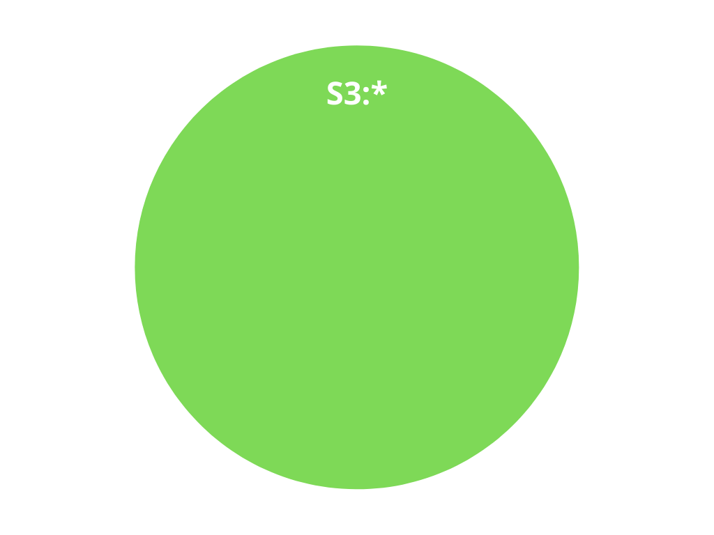
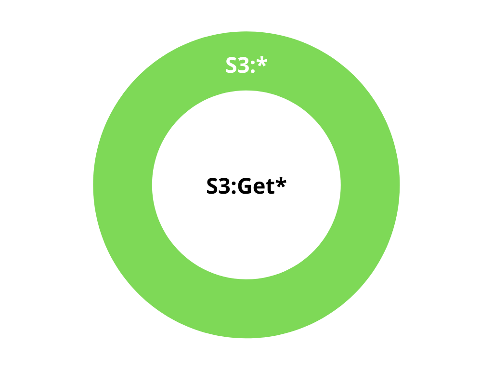
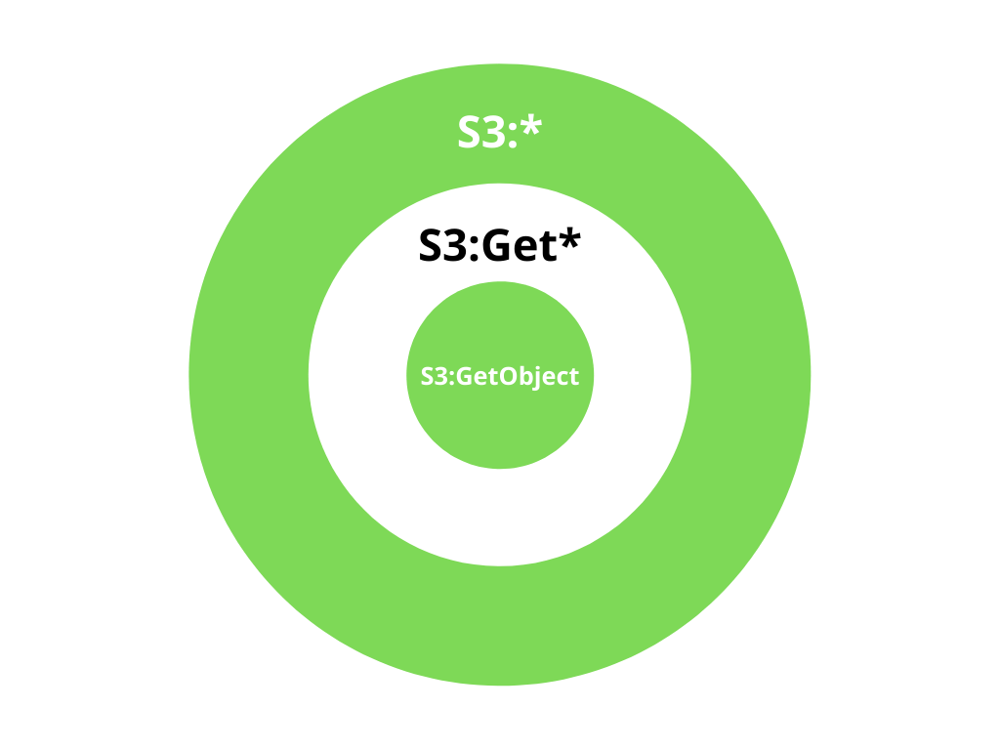
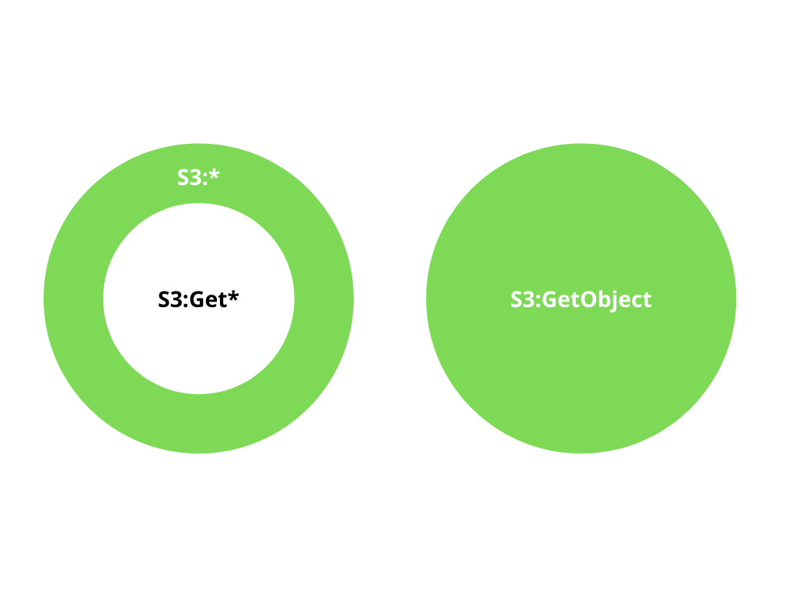

Understanding Effective Actions
================================

In PolicyGlass we express ARPs (:class:`~policyglass.action.Action` :class:`~policyglass.resource.Resource` :class:`policyglass.principal.Principal`) as though they are potentially
infinite sets. 

In reality they are finite sets because there are only a finite number of allowed actions, resources, or principals.
However because actions are being constantly updated by AWS, and new resources and princiapls are being created all 
the time, we here treat them as infinite sets because their extent is unknowable by us when we are parsing the policy.

Components of an EffectiveAction
-----------------------------------

An :class:`~policyglass.action.EffectiveAction` object has two components:

#. :attr:`~policyglass.action.EffectiveAction.inclusion` 
#. :attr:`~policyglass.action.EffectiveAction.exclusions`

The inclusions indicate the :class:`~policyglass.action.Action` that this effective action applies to
and the exclusions indicate the actions that this effective action *does not* apply to.

At its simplest an effective action is just an inclusion, which you can think of as a Venn diagram
containing ``S3:*``.

    EffectiveAction without exclusion

Then if you have an exclusion of ``S3:Get*`` you can think of this as a hole punched in the Venn diagram.

    EffectiveAction with exclusion

The area in the middle indicating that ``S3:Get*`` is not included in the effective action.

Difference 
-------------

The *difference* between set *x* and set *y* is the elements 
that are contained in set *x* that are not contained in set *y*.
In essence it's a subtraction. Remove the elements in set *y* from set *x* and you have the difference.

Simple
""""""""""

Let's say we calculate the difference between two effective actions like so.

.. doctest :: 
    
    >>> from policyglass import EffectiveAction, Action
    >>> x = EffectiveAction(inclusion=Action("S3:*"))
    >>> y = EffectiveAction(inclusion=Action("S3:Get*"))
    >>> x.difference(y)
    [EffectiveAction(inclusion=Action('S3:*'), exclusions=frozenset({Action('S3:Get*')}))]

The result is that the inclusion from *y* is added to the *exclusions* of *x*.

    Simple Difference

- ``S3:*`` is the ``inclusion`` from ``x``
- ``S3:Get*`` is the ``inclusion`` from ``y``

The inclusion from *x* is added as an exclusion of *y* is because our Actions are essentially infinite sets. The wildcard at the end of ``S3:*`` 
could extend to an infinitely long string for all we know, so we can't create an :class:`~policyglass.action.Action` that 
expresses `S3:*` but not `S3:Get*` so we must add it as an exclusion in an :class:`~policyglass.action.EffectiveAction`.

This is the reason :class:`~policyglass.action.EffectiveAction` s exist, so we can express the 
intersection of the complement of ininite set B with inifite set A.

Complex
""""""""""""

Let's say we have two effective actions we want to diff.
One is just ``S3:*`` and the other is ``S3:Get*`` except for ``S3:GetObject``.
To diff these we want to subtract ``S3:Get*`` from ``S3:*`` but leave ``S3:GetObject`` in place.

.. doctest :: 
    
    >>> from policyglass import EffectiveAction, Action
    >>> x = EffectiveAction(inclusion=Action("S3:*"))
    >>> y = EffectiveAction(inclusion=Action("S3:Get*"), exclusions=frozenset({Action("S3:GetObject")}))
    >>> print(x.difference(y))
    [EffectiveAction(inclusion=Action('S3:*'), exclusions=frozenset({Action('S3:Get*')})),
     EffectiveAction(inclusion=Action('S3:GetObject'), exclusions=frozenset())]

Let's unpack what happened here.

1. We added the *inclusion* (``S3:get*``) from *y* to the exclusions of *x*
2. We returned a new effective action that is just ``S3:GetObject``

    Complex Difference (theoretical)

- ``S3:*`` is our ``inclusion`` from ``x``
- ``S3:Get*`` is our ``inclusion`` from ``y``
- ``S3:GetObject`` is our ``exclusion`` from ``y``

In the above Venn diagram we're showing that the difference between the two effective actions is 
to include ``S3:*`` except ``S3:Get*`` but still include ``S3:GetObject``.
We can't have an inclusion inside an exclusion so we represent this by adding another effective action object 
to represent the inclusion.

    Complex Difference (actual output)

Outputting two effective actions makes a list of :class:`~policyglass.policy_shard.PolicyShard` objects
much easier to understand because you will end up with two shards (one for each effective action) rather
than one super hard to understand shard that has an action inclusion inside an action exclusion inside an 
action inclusion.

Remember that the exclusions in an EffectiveAction are negations, they are holes punched in what's allowed.
As a result, what is in the exclusion of *y* should **not** be removed from *x* because it's explicitly not part of *y*.

Because we can't express the fact that we want to exclude B and C but **include** A in our result, we have to return 
two separate :class:`~policyglass.action.EffectiveAction` s, one which includes A but the entirety of B, and another that just includes D.
