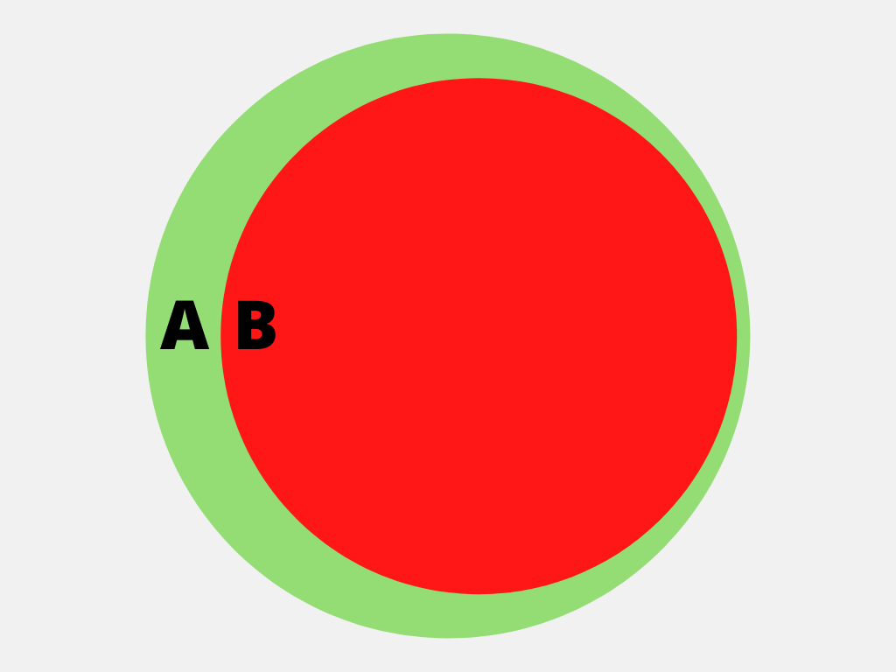
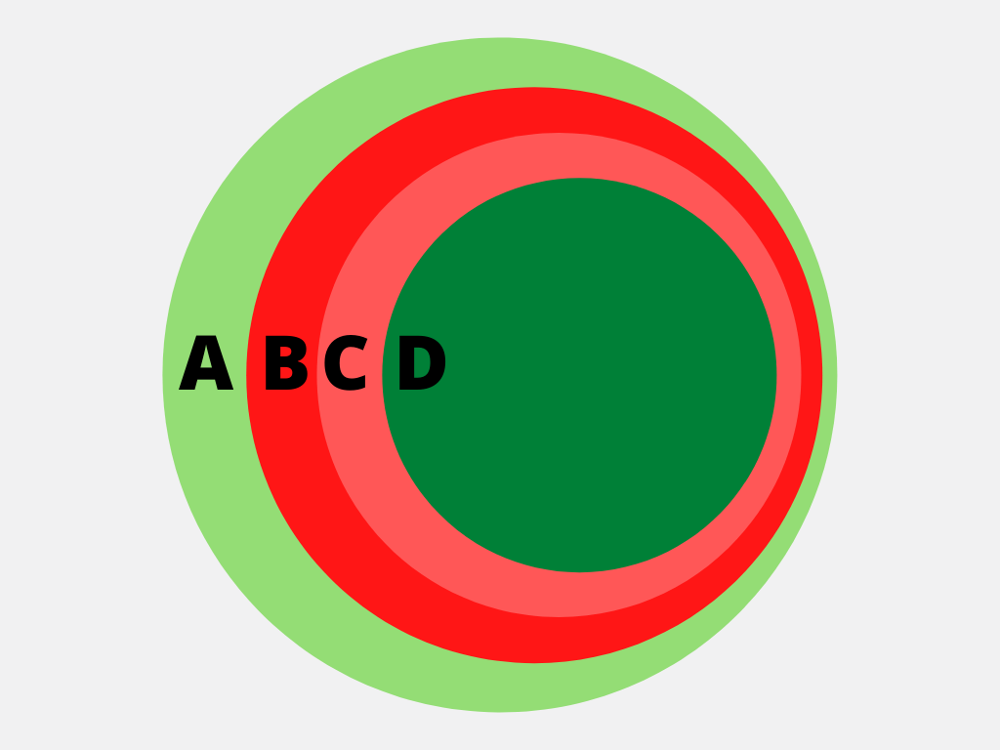

Effective Actions
===================

In PolicyGlass we express ARPs (:class:`~Action` :class:`~Resource` :class:`Principal`) as though they are potentially
infinite sets. 

In reality they are finite sets because there are only a finite number of allowed actions, resources, or principals.
However because actions are being constantly updated by AWS, and new resources and princiapls are being created all 
the time, we here treat them as infinite sets because their extent is unknowable by us when we are parsing the policy.

Difference 
-------------

The *difference* between set *x* and set *y* is the elements 
that are contained in set *x* that are not contained in set *y*.
In essence it's a subtraction. Remove the elements in set *y* from set *x* and you have the difference.

Simple
""""""""""

Let's say we calculate the difference between two effective actions like so.

.. doctest :: 
    
    >>> from pprint import pprint
    >>> from policyglass import EffectiveAction, Action
    >>> x = EffectiveAction(inclusion=Action("S3:*"))
    >>> y = EffectiveAction(inclusion=Action("S3:Get*"))
    >>> x.difference(y)
    [EffectiveAction(inclusion=Action('S3:*'), exclusions=frozenset({Action('S3:Get*')}))]

The result is that the inclusion from *y* is added to the *exclusions* of *x*.

    Simple Effective Difference

- *A* is the ``inclusion`` from ``x``
- *B* is the ``inclusion`` from ``y``

The inclusion from *x* is added as an exclusion of *y* is because our Actions are essentially infinite sets. The wildcard at the end of ``S3:*`` 
could extend to an infinitely long string for all we know, so we can't create an :class:`~Action` that 
expresses `S3:*` but not `S3:Get*` so we must add it as an exclusion in an :class:`~EffectiveAction`.

This is the reason :class:`~EffectiveAction` s exist, so we can express the 
intersection of the complement of ininite set B with inifite set A.

Complex
""""""""""""

Let's say we have two effective actions like so:

.. doctest :: 
    
    >>> from pprint import pprint
    >>> from policyglass import EffectiveAction, Action
    >>> x = EffectiveAction(inclusion=Action("S3:*"))
    >>> y = EffectiveAction(inclusion=Action("S3:Get*"), exclusions=frozenset({Action("S3:GetObject")}))
    >>> pprint(x.difference(y))
    [EffectiveAction(inclusion=Action('S3:*'), exclusions=frozenset({Action('S3:Get*')})),
     EffectiveAction(inclusion=Action('S3:GetObject'), exclusions=frozenset())]

Let's unpack what happened here.

1. We added the *inclusion* (``S3:get*``) from *y* to the exclusions of *x*
2. We returned *y* unchanged.

Why? What's happening here?

    Complex Effective Difference

- *A* is our ``inclusion`` from ``x``
- *B* is our ``exclusion`` from ``x`` (which we added in order to accurately refect the *difference*)
- *C* is our ``inclusion`` from ``y``
- *D* is our ``exclusion`` from ``y``

In the *simple* example we added the inclusion from *y* to the exclusions of *x* because that's what difference means, 
but why did we return *y* unchanged in the list?

Remember that the exclusions in an EffectiveAction are negations, they are holes punched in what's allowed.
As a result, what is in the exclusion of *y* should **not** be removed from *x* because it's explicitly not part of *y*.

Because we can't express the fact that we want to exclude B and C but **include** A in our result, we have to return 
two separate :class:`~EffectiveAction` s, one which includes A but the entirety of B, and another that just includes D.
